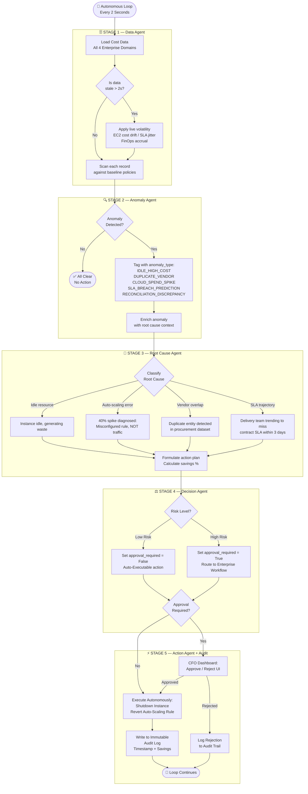
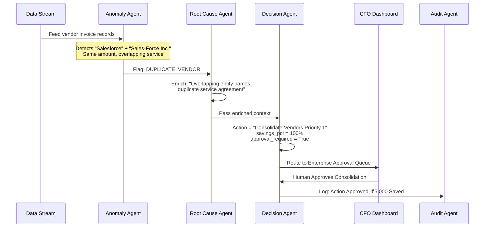
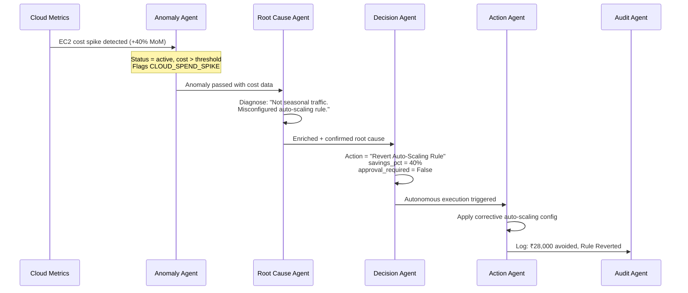
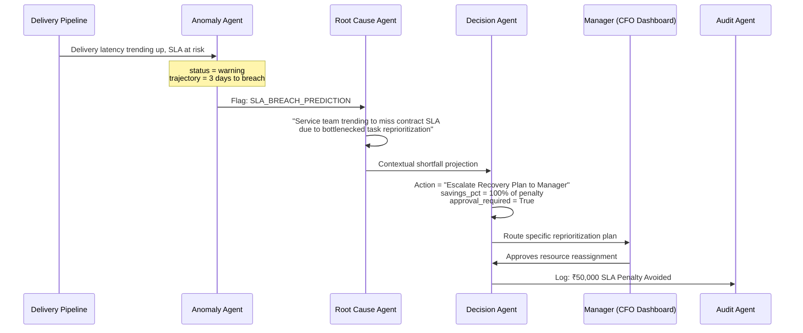
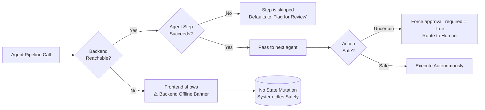

# AutoCost Guardian AI — Architecture Document
**ET AI Hackathon 2026 | Track 3: Cost Intelligence & Autonomous Action**
*Prepared by Team AutoCost Guardian AI | March 2026*

---

## Page 1 — System Architecture & Agent Pipeline

### 1. System Overview

AutoCost Guardian AI is a **5-agent sequential orchestration platform** that transforms static cost dashboards into an actively remediating enterprise intelligence system. The system continuously observes live enterprise data, reasons about anomalies using specialized agents, and either autonomously fixes issues or routes them through enterprise approval workflows — all with a full audit trail.

> **Core Design Philosophy:** No single LLM prompt. No monolithic chatbot. Every decision is the result of a structured pipeline where domain-specific agents exchange verified context before any action is taken.

---

### 2. High-Level System Architecture

```
┌─────────────────────────────────────────────────────────────────────────┐
│                     AUTOCOST GUARDIAN AI PLATFORM                       │
│                                                                         │
│  ┌──────────────┐   ┌──────────────┐   ┌──────────────┐                │
│  │  Cloud Infra │   │ Vendor/Spend │   │  SLA/Latency │  ... (data)    │
│  │  (EC2, RDS)  │   │ Invoice APIs │   │  Metrics     │                │
│  └──────┬───────┘   └──────┬───────┘   └──────┬───────┘                │
│         └──────────────────┴──────────────────-┘                        │
│                             │                                           │
│                     ┌───────▼────────┐                                  │
│                     │  DATA AGENT    │  ← Polls every 2s               │
│                     │  (Observation) │                                  │
│                     └───────┬────────┘                                  │
│                             │ Structured records (domain-tagged JSON)   │
│                     ┌───────▼────────┐                                  │
│                     │ ANOMALY AGENT  │  ← Pattern matcher               │
│                     │  (Detection)   │    Idle costs, vendor dups,      │
│                     └───────┬────────┘    SLA breach prediction         │
│                             │ Flagged anomalies + anomaly_type          │
│                     ┌───────▼────────┐                                  │
│                     │  ROOT CAUSE    │  ← Context enrichment            │
│                     │    AGENT       │    Why did this happen?          │
│                     └───────┬────────┘    (not just what happened)      │
│                             │ Root cause + domain context               │
│                     ┌───────▼────────┐                                  │
│                     │ DECISION AGENT │  ← Strategy + risk assessment   │
│                     │  (Strategist)  │    Calculates savings %, sets   │
│                     └───────┬────────┘    approval_required flag        │
│                             │                                           │
│             ┌───────────────┴───────────────┐                          │
│             ▼                               ▼                          │
│    ┌────────────────┐              ┌─────────────────┐                  │
│    │  AUTO-EXECUTE  │              │ ENTERPRISE QUEUE│                  │
│    │  ACTION AGENT  │              │ (Approval Flow) │                  │
│    │ (Low-risk fix) │              │ (High-impact)   │                  │
│    └────────┬───────┘              └────────┬────────┘                  │
│             └──────────────┬────────────────┘                          │
│                     ┌──────▼──────┐                                     │
│                     │ AUDIT AGENT │  ← Immutable compliance log        │
│                     └─────────────┘                                     │
└─────────────────────────────────────────────────────────────────────────┘
```

---

### 3. Full Agentic Pipeline Flowchart



---

## Page 2 — Scenario Walkthroughs & Enterprise Design

### 4. Hackathon Scenario Execution Flows

#### Scenario A — Duplicate Vendor Detection



#### Scenario B — Cloud Spend Spike (40% MoM)



#### Scenario C — SLA Penalty Prevention (3 Days Remaining)



---

### 5. Technology Stack & Integration Map

| Layer | Technology | Role |
| :--- | :--- | :--- |
| **Frontend** | React (Vite) + Recharts | Live dashboard, KPI tiles, anomaly feed, approval workflows |
| **API Layer** | FastAPI (Python) | RESTful endpoints for detect, forecast, approve/reject, AI chat |
| **Agent Layer** | Custom Python Agents | 5-stage pipeline: Data → Anomaly → Root Cause → Decision → Action |
| **Agentic Pattern** | Sequential + HITL Orchestration | Agents pass structured context; no brute-force LLM chaining |
| **Real-time Loop** | `asyncio` + 2s polling | Backend data mutation + Frontend `setInterval` fetching |
| **AI Intelligence** | Rule-based + NLP intent matching | CFO AI Chat queries live anomaly data for answers |
| **Audit & Compliance** | In-memory log + API endpoint | Every action is serialized with timestamp, domain, and savings |

---

### 6. Error Recovery & Graceful Degradation



> **Key Enterprise Principle:** If any agent step fails or returns an unclassified result, the system **defaults to the safest path** — flagging the record for human review rather than executing a destructive or incorrect action. No silent failures.

---

### 7. Evaluation Rubric Alignment Summary

| Rubric Dimension | Weight | How AutoCost Guardian Satisfies It |
| :--- | :---: | :--- |
| **Autonomy Depth** | 30% | Low-risk actions execute without any human. System recovers silently from agent failures by defaulting to human queue. |
| **Multi-Agent Design** | 20% | 5 cleanly separated specialist agents. Context passed as structured JSON, not raw text. Sequential orchestration with a clear master controller (`main.py`). |
| **Technical Creativity** | 20% | Live 2-second telemetry loop, in-browser CFO AI Chat backed by live agent data, domain-specific reasoning chains. |
| **Enterprise Readiness** | 20% | Human-in-the-Loop approval workflow, immutable audit trail, graceful degradation on failures. |
| **Impact Quantification** | 10% | ₹1,300,000 annualized ROI with per-scenario math. Before/after cost state visible on live dashboard. |
