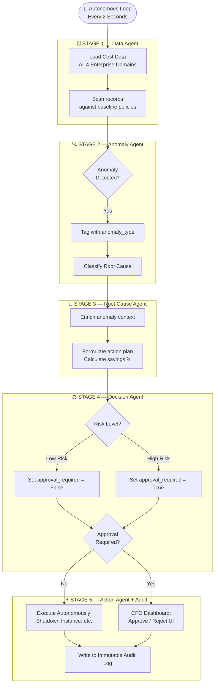

# AutoCost Guardian AI — System Architecture Document

## 1. System Architecture Diagram

---

## 2. Agent Roles & Responsibilities

The system abandons monolithic LLM prompting in favor of a specialized **5-Agent Pipeline**. Each agent operates asynchronously, possessing a distinct boundary of responsibility.

*   **Data Agent (The Eyes):** Ingests raw telemetry from diverse corporate sources. It actively monitors AWS billing intervals, Azure vendor spends, and real-time SLA Datadog latencies to build a universal financial context state.
*   **Anomaly Agent (The Filter):** Acts as the frontline defense against alert fatigue. Instead of passing massive JSON payloads to reasoning models, this agent scrubs the data against heuristic rules (e.g., Idle CPU < 2%, Vendor Duplicates logic) and filters out noise.
*   **Root Cause Agent (The Brain):** Takes filtered exceptions and determines the true origin of the cost spike. For example, it differentiates between a justified seasonal traffic spike and a misconfigured auto-scaling rule, preventing disastrous automated rollbacks on valid traffic.
*   **Decision Agent (The Strategist):** Generates the remediation strategy and assigns Risk Profiles. It calculates the explicit percentage of cost recovery and strictly dictates whether the solution can be executed autonomously (`approval_required: False`) or must hit the human queue (`approval_required: True`).
*   **Action Agent (The Hands):** The execution layer that interacts with the real world. It issues the Boto3/Azure API calls to shut down resources or halt vendor payments, and sequentially commits all actions to the Immutable Audit Log.

---

## 3. Agent Communication & State Management

Agents communicate via a strictly typed, sequential **Context Payload Dictionary**. Instead of loosely passing conversational strings, agents append structured key-value intelligence to the payload as it travels down the pipeline:

1.  `Data Agent` initiates the state: `{"instance_id": "i-0abc", "cost": 450.00}`.
2.  `Anomaly Agent` adds detection tags: `{"anomaly_type": "IDLE_HIGH_COST"}`.
3.  `Decision Agent` adds executable policies: `{"recommended_action": "Shutdown", "approval_required": False}`.

This localized state pattern guarantees zero memory drift, meaning the Action Agent always executes based on purely verified data, preventing dangerous halluncinations.

---

## 4. Tool Integrations (Simulated Architecture)

To guarantee high-speed, zero-latency execution during high-stakes demonstrations, the current architecture relies on a **High-Fidelity Offline Expert Rules Simulation**. 

However, the pipeline logic is designed structurally to integrate with the following enterprise toolkits on day-one of production:
*   **AWS Cost Explorer & Boto3 IAM APIs:** Replaces the Data Agent's local file mapping to pull live EC2 pricing, and empowers the Action Agent to issue true SSH/Shutdown commands.
*   **Datadog / New Relic Webhooks:** Ingests live application latency to predict SLA penalites.
*   **Coupa / Jira / ServiceNow:** The Decision Agent's human-in-the-loop (`approval_required: True`) natively maps to opening ServiceNow enterprise tickets for CFO/FinOps approval workflows.

---

## 5. Error-Handling & Graceful Degradation Logic

AutoCost Guardian AI is designed for robust Enterprise Readiness, avoiding pipeline crashes even when external cloud systems fail.

**Graceful Degradation Mechanism:**
When the **Action Agent** receives instructions to autonomously shut down a bleeding cloud resource, it initiates a `try/except` execution block. If the simulated AWS/Azure API returns a `502 Rate Limit Reached` or an `IAM Permissions Error`:
1.  The agent intercepts the exception.
2.  The pipeline **does not crash**.
3.  The Action Agent dynamically downgrades the execution status to `"Execution Blocked — Escalating Safely"`.
4.  The system flips the resolution tag to `FALLBACK: Routed to Manual Review`, alerting the FinOps managerial team without dropping the cost-saving recommendation.
