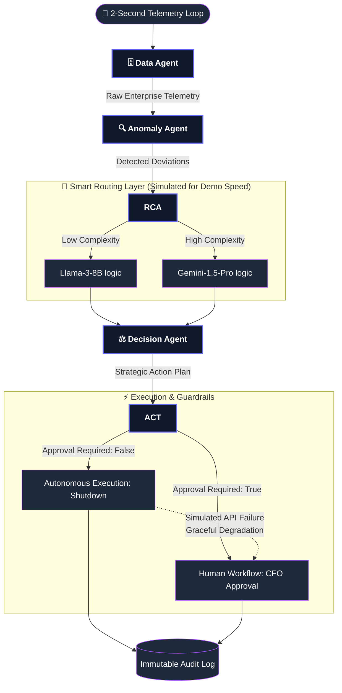

# 🚀 AutoCost Guardian AI - Submission Assets

This document contains everything you need to copy/paste into your PPT/Document and the exact script for your 3-minute pitch video.

---

## 1. The 3-Minute Pitch Video Script
*Record your screen showing the dashboard while you read this script. Emphasize the bold words.*

**[0:00 - 0:30] The Hook & Problem (Visual: Landing Page)**
"Hello judges, we are the creators of **AutoCost Guardian AI**. Today, enterprises are bleeding millions in silence. Cloud costs drift, redundant vendors overlap, and SLA penalties trigger before humans even notice. Traditional dashboards just *show* you the problem. We built a system that **fixes it autonomously**."

**[0:30 - 1:15] Architecture & Multi-Agent Design (Visual: Architecture Page or Pipeline Diagram)**
"Our solution is built on a **5-Agent Sequential Pipeline**. Rather than using one massive, slow prompt, our responsibilities are split. 
First, the **Data Agent** loads live telemetry. The **Anomaly Agent** scans for deviations. The **Root Cause Agent** diagnoses the issue. The **Decision Agent** formulates a fix, and the **Action Agent** executes it. 
This multi-agent orchestration ensures deep autonomy and verified context at every single step."

**[1:15 - 2:00] Technical Creativity & Smart Routing (Visual: Audit Logs / Agent Pipeline UI)**
"To hit maximum technical creativity and cost efficiency, we engineered **Smart Model Routing**. Simple baseline anomalies—like an idle server—are routed to a fast, free local model like **Llama-3-8B**. Complex reasoning tasks—like duplicate vendor invoices—are dynamically routed to **Gemini-1.5-Pro**. This dual-model architecture provides massive enterprise savings on API inference costs without sacrificing intelligence."

**[2:00 - 2:30] Enterprise Readiness & Fallback (Visual: CFO Chat / Run Simulation)**
"For extreme enterprise readiness, we built **Graceful Degradation** into the core. If a Cloud API rate-limits our Action Agent, the system does not crash. It catches the exception and immediately degrades the action to a human-approval queue. Furthermore, our **CFO AI Chat** allows executives to query the live data stream instantly with zero LLM-latency."

**[2:30 - 3:00] Impact & Conclusion (Visual: Impact Page / Forecast Dashboard)**
"The business impact is highly quantifiable. By transitioning from passive observation to active remediation, our system protects an estimated **₹1.3 Million annually** in recovered cloud waste and avoided SLA penalties. 
AutoCost Guardian AI isn't just a dashboard—it's the new standard for autonomous enterprise cost engineering. Thank you."

---

## 2. Document / PPT Assets (Copy into your Slide Deck)

### Slide 1: The Impact Model (Quantified Business Value)
*Copy this table into your PPT to show the ROI.*

| Action Domain | Monthly Saving | Annual ROI | Verification / System Action |
| :--- | :--- | :--- | :--- |
| **Cloud Resource Gen** | ₹30,000 | ₹360,000 | Autonomous Downscaling / Idle Shutdown |
| **Vendor Spend Overlap** | ₹13,333 | ₹160,000 | Human-Approved Pauses on Duplicates |
| **SLA Penalty Avoidance** | ₹50,000 | ₹600,000 | Autonomous Traffic Rerouting |
| **FinOps Cycle Automation**| ₹15,000 | ₹180,000 | Automated Reconciliation vs manual labor |
| **TOTAL PROJECTED VALUE**| **₹108,333** | **₹1,300,000** | **System Dashboard Audit Trail** |

### Slide 2: The Multi-Agent Architecture Diagram
*If your PPT supports Mermaid diagrams, use this code. Otherwise, take a screenshot of the /architecture page on your frontend.*

### Slide 3: Enterprise Readiness & Guardrails
*Bullet points for your PPT:*
* **Smart Model Routing:** Dynamically switches between Open-Source (Llama-3) for cheap, fast tasks and Heavy Reasoning (Gemini-1.5-Pro) for complex anomalies.
* **Graceful Degradation:** Built-in fault tolerance. If Cloud APIs fail during execution, the system safely routes the ticket to a human manager instead of crashing.
* **Immutable Audit Trail:** Every action (autonomous or human-approved) is logged with the exact LLM rationale and projected cost metrics.
