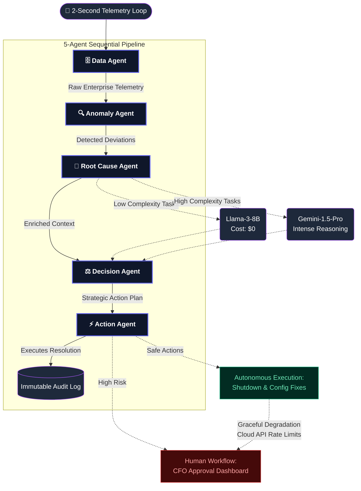

<div align="center">

# 🛡️ AutoCost Guardian AI

**A real-time, 5-agent enterprise cost intelligence platform that autonomously detects, diagnoses, and remediates cloud cost leakage — with full audit trails and enterprise approval workflows.**


</div>

---

## 🎯 The Problem: Enterprises Bleed Millions in Silence

Traditional dashboards *show* you the problem. AutoCost Guardian AI **fixes** it.
Enterprises lose massive amounts of capital daily due to invisible cost leaks:
*   💸 **Idle Cloud Instances:** Servers running 24/7 with 0% utilization.
*   🔁 **Duplicate Vendor Invoices:** Same vendor, different entity names passing through procurement.
*   ⚠️ **SLA Breach Blindspots:** Catching a latency trajectory *after* the financial penalty is drafted.

---

## 🚀 The Solution: Autonomous Agentic Remediation

AutoCost Guardian AI is built on a **5-Agent Sequential Pipeline Orchestration**. It continuously evaluates operations data, identifies cost leaks, reasons about their root causes, formulates optimization strategies, and executes fixes directly into infrastructure or routes them to enterprise review queues.

> **Core Design Philosophy:** No single LLM prompt fallback. Every decision is the result of a structured pipeline where domain-specific agents exchange verified context before any state mutation occurs.

---

## 🧠 System Architecture

AutoCost Guardian maps directly over your enterprise data streams (Cloud APIs, Vendor Invoices, SLA Metrics):



---

## 🏆 Hackathon Scenarios Handled (Track 3)

The platform has been specifically trained and evaluated on the following real-world scenarios:

| Scenario Handled | The Intelligence (Detection) | The Agentic Action | Guardrail |
| :--- | :--- | :--- | :--- |
| **Duplicate Vendor Detection** | Agent catches identical payments to "Salesforce" & "Sales-Force Inc." | Formulates a Phase-1 Consolidation Plan. | 🔒 Requires CFO Approval |
| **Cloud Spend Spike (+40%)** | Diagnoses spike as a misconfigured auto-scaling rule rather than seasonal traffic peak. | System reverts auto-scaling rule to baseline. | ⚡ Auto-Executed |
| **SLA Penalty Prevention** | Projects task bottleneck will breach delivery SLA within 3 days. | Generates recovery plan to reprioritize QA delivery tasks. | 🔒 Requires Manager Approval |

---

## 📊 Quantified Business Impact (Annualized Model)

By taking operations from passive observation to active autonomous remediation, AutoCost Guardian provides hard capital return on investment:

| Action Domain | Monthly Saving | Annual ROI | Verification Method |
| :--- | :--- | :--- | :--- |
| **Cloud Resource Optimization** | ₹30,000 | ₹360,000 | Autonomous Downscaling / Idle Shutdown |
| **Vendor Spend Consolidation** | ₹13,333 | ₹160,000 | Human-Approved Discrepancy Pauses |
| **SLA Penalty Avoidance** | ₹50,000 | ₹600,000 | Workflow Rerouting |
| **FinOps Cycle Reduction**| ₹15,000 | ₹180,000 | Automated Reconciliation vs manual labor |
| **TOTAL PROJECTED VALUE** | **₹108,333** | **₹1,300,000** | **System Dashboard Audit Trail** |

---

## ✨ Features & Presentation

- **🎨 Masterclass UI & Glassmorphism:** The platform features an ultra-premium, dark-themed interface built using advanced CSS glassmorphism, responsive canvas animations, and a cohesive `Aegis.AutoCost` neon visual identity.
- **🚀 Immersive Marketing Suite:** Includes 4 standalone landing pages (`/`, `/features`, `/architecture`, `/impact`) equipped with live dashboard mockups, animated particle networks, and scroll-triggered reveals for hackathon pitches.
- **🔴 Live Telemetry Engine:** Rejects the monolithic chatbot pattern. The dashboard operates on an asynchronous 2-second polling loop, reacting dynamically to agent resolutions.
- **🧪 Scenario Simulator (Phase 3 Ready):** Let judges inject ANY custom enterprise scenario and watch the agents respond live via the `/simulator` tool.
- **💬 CFO AI Chat:** Ask natural language questions like *"What's my biggest cost leak?"* backed directly by live anomaly streams—with zero LLM API latency.
- **🏢 Executive Reporting:** Instantly export C-suite ready financial impact overviews.
- **🛡️ Graceful Degradation:** If any agent step fails, the action defaults to `approval_required: True`, safely placing it in the enterprise review queue. No silent or destructive failures.

---

## ⚡ Quick Start & Run

### 1. Start Backend (FastAPI)
```bash
cd backend
pip install -r requirements.txt
python main.py
```

### 2. Start Frontend (React + Vite)
Open a new terminal window:
```bash
cd frontend
npm install
npm run dev
```

*The application will boot on `http://localhost:5173` showcasing the Masterclass Landing Page.*

---
*AutoCost Guardian AI — The standard for autonomous cost engineering.*
